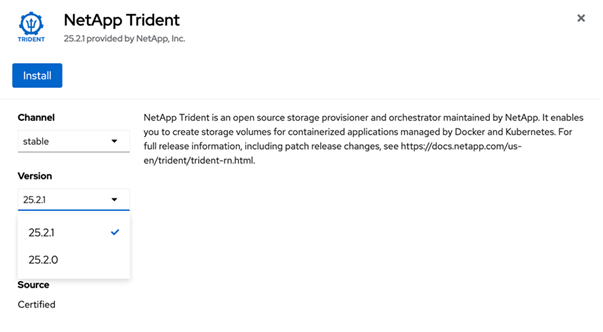

= 使用OpenShift OperatorHub安装Trident
:hardbreaks:
:allow-uri-read: 
:icons: font
:imagesdir: ../media/

[role="lead"]
如果您使用的是Red Hat OpenShift、则可以通过Red Hat认证操作员安装NetApp Trident。使用此过程从Red Hat OpenShift容器平台安装Trident。

.开始之前
开始安装之前，link:../trident-get-started/requirements.html["准备安装Trident的环境"]。

== 找到并安装Trident运算符

.步骤
. 导航到OpenShift OperatorHub并搜索NetApp Trident。
+
image::../media/openshift-operator-01.png[Trident 运算符]

. 单击 * 安装 * 。
+

. 选择所需选项，然后单击*Install*。
+
image::../media/openshift-operator-03.png[安装]

. 安装完成后、操作员将显示在已安装操作员列表中。
+
image::../media/openshift-operator-04.png[已安装]

. 创建类似于operator软件包安装的Torc。

== 卸载Trident Operator

.步骤
. 从已安装操作员列表中选择Trident操作员。
+
image::../media/openshift-operator-05.png[安装]

. 选择是否要从操作符中删除所有操作数实例。
+
image::../media/openshift-operator-06.png[已安装]

+

WARNING: 如果未选中“*从该运算符中删除所有操作数实例*”复选框，则不会卸载Trident。

. 单击 * 卸载 * 。

