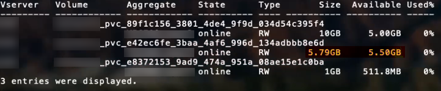

= ONTAP SAN配置选项和示例
:hardbreaks:
:allow-uri-read: 
:icons: font
:imagesdir: ../media/

[role="lead"]
了解如何在Trident安装中创建和使用ONTAP SAN驱动程序。本节提供了将后端映射到StorageClasses的后端配置示例和详细信息。

link:https://docs.netapp.com/us-en/asa-r2/get-started/learn-about.html["ASA r2系统"^]与其他ONTAP系统（ASA、 AFF和FAS）在存储层的实现上有所不同。这些变化会影响某些参数的使用，如注释中所述。link:https://docs.netapp.com/us-en/asa-r2/learn-more/hardware-comparison.html["详细了解 ASA r2 系统与其他 ONTAP 系统之间的差异"^]。

NOTE: 只有 `ontap-san`ASA r2 系统支持驱动程序（支持 iSCSI、NVMe/TCP 和 FC 协议）。

在Trident后端配置中，无需指定您的系统是ASA r2。当您选择 `ontap-san`作为 `storageDriverName`Trident可自动检测ASA r2 或其他ONTAP系统。如下表所示，某些后端配置参数不适用于ASA r2 系统。

== 后端配置选项

有关后端配置选项，请参见下表：

[cols="1,3,2"]
|===
| 参数 | Description | Default 

| `ve版本` |  | 始终为 1 

| `storageDriverName` | 存储驱动程序的名称 | `ontap-san`或 `ontap-san-economy` 

| `backendName` | 自定义名称或存储后端 | 驱动程序名称+"_"+ dataLIF 

| `m年` 月 日  a| 
集群或SVM管理LIF的IP地址。

可以指定完全限定域名(FQDN)。

如果Trident是使用IPv6标志安装的、则可以设置为使用IPv6地址。IPv6地址必须用方括号定义，例如 `[28e8:d9fb:a825:b7bf:69a8:d02f:9e7b:3555]`。

有关无缝MetroCluster切换的信息，请参见<<mcc-best>>。

NOTE: 如果您使用的是"vsadmin"凭据、 `managementLIF`则必须是SVM的凭据；如果使用的是"admin"凭据、则必须是集群的凭据 `managementLIF`。
| "10.0.0.1"、"[2001：1234：abc：：：fefe]" 

| `dataLIF` | 协议 LIF 的 IP 地址。如果Trident是使用IPv6标志安装的、则可以设置为使用IPv6地址。IPv6地址必须用方括号定义，例如 `[28e8:d9fb:a825:b7bf:69a8:d02f:9e7b:3555]`。*不指定iSCSI。*Trident使用link:https://docs.netapp.com/us-en/ontap/san-admin/selective-lun-map-concept.html["ONTAP 选择性LUN映射"^]发现建立多路径会话所需的iSCSI LUN。如果明确定义、则会生成警告 `dataLIF`。*省略MetroCluster。*请参见<<mcc-best>>。 | 由SVM派生 

| `sVM` | 要使用的 Storage Virtual Machine

*对于MetroCluster省略。*请参见 <<mcc-best>>。 | 如果指定了 SVM `managementLIF` ，则派生 

| `使用 CHAP` | 使用CHAP对iSCSI的ONTAP SAN驱动程序进行身份验证[布尔值]。将设置为 `true`、以便Trident配置双向CHAP并将其用作后端中给定SVM的默认身份验证。有关详细信息、请参见 link:ontap-san-prep.html["准备使用ONTAP SAN驱动程序配置后端"] 。*不支持 FCP 或 NVMe/TCP。* | `false` 

| `chapInitiatorSecret` | CHAP 启动程序密钥。如果为 `useCHAP=true` ，则为必需项 | "" 

| `标签` | 要应用于卷的一组任意 JSON 格式的标签 | "" 

| `chapTargetInitiatorSecret` | CHAP 目标启动程序密钥。如果为 `useCHAP=true` ，则为必需项 | "" 

| `chapUsername` | 入站用户名。如果为 `useCHAP=true` ，则为必需项 | "" 

| `chapTargetUsername` | 目标用户名。如果为 `useCHAP=true` ，则为必需项 | "" 

| `客户端证书` | 客户端证书的 Base64 编码值。用于基于证书的身份验证 | "" 

| `clientPrivateKey` | 客户端专用密钥的 Base64 编码值。用于基于证书的身份验证 | "" 

| `trustedCACertifate` | 受信任 CA 证书的 Base64 编码值。可选。用于基于证书的身份验证。 | "" 

| `用户名` | 与ONTAP集群通信所需的用户名。用于基于凭证的身份验证。有关 Active Directory 身份验证，请参阅 link:../trident-use/ontap-san-examples.html#authenticate-trident-to-a-backend-svm-using-active-directory-credentials["使用 Active Directory 凭据向后端 SVM 验证Trident 的身份"]。 | "" 

| `密码` | 与ONTAP集群通信所需的密码。用于基于凭证的身份验证。有关 Active Directory 身份验证，请参阅 link:../trident-use/ontap-san-examples.html#authenticate-trident-to-a-backend-svm-using-active-directory-credentials["使用 Active Directory 凭据向后端 SVM 验证Trident 的身份"]。 | "" 

| `sVM` | 要使用的 Storage Virtual Machine | 如果指定了 SVM `managementLIF` ，则派生 

| `s存储前缀` | 在 SVM 中配置新卷时使用的前缀。无法稍后修改。要更新此参数、您需要创建一个新的后端。 | `trident` 

| `聚合`  a| 
要配置的聚合（可选；如果设置了聚合，则必须将其分配给 SVM ）。对于 `ontap-nas-flexgroup`驱动程序、此选项将被忽略。如果未分配、则 可以使用任何可用聚合来配置FlexGroup卷。

NOTE: 在SVM中更新聚合后、该聚合将在Trident中自动更新、方法是轮询SVM、而无需重新启动Trident控制器。在Trident中配置了特定聚合以配置卷后、如果将该聚合重命名或移出SVM、则在轮询SVM聚合时、后端将在Trident中变为故障状态。您必须将聚合更改为SVM上的聚合、或者将其全部删除、以使后端恢复联机。

*不要指定 ASA r2 系统*。
 a| 
""

| `limitAggregateUsage` | 如果使用量超过此百分比，则配置失败。如果您使用的是Amazon FSx for NetApp ONTAP后端，请勿指定 `limitAggregateUsage`。提供的和 `vsadmin`不包含使用Trident检索聚合使用情况并对其进行限制所需的 `fsxadmin`权限。*不要指定 ASA r2 系统*。 | "" （默认情况下不强制实施） 

| `limitVolumeSize` | 如果请求的卷大小超过此值、则配置失败。此外、还会限制它为LUN管理的卷的大小上限。 | ""(默认情况下不强制实施) 

| `lunsPerFlexvol` | 每个 FlexVol 的最大 LUN 数，必须在 50 ， 200 范围内 | `100` 

| `debugTraceFlags` | 故障排除时要使用的调试标志。例如、｛"api"：false、"METHO"：true｝

除非正在进行故障排除并需要详细的日志转储、否则请勿使用。 | `null` 

| `useREST`  a| 
使用ONTAP REST API 的布尔参数。

 `useREST`当设置为 `true`， Trident使用ONTAP REST API 与后端通信；当设置为 `false`， Trident使用 ONTAPI（ZAPI）调用与后端进行通信。此功能需要ONTAP 9.11.1 及更高版本。此外，使用的ONTAP登录角色必须具有访问 `ontapi`应用。这是通过预定义的 `vsadmin`和 `cluster-admin`角色。从Trident 24.06 版本和ONTAP 9.15.1 或更高版本开始， `useREST`设置为 `true`默认；改变 `useREST`到 `false`使用 ONTAPI (ZAPI) 调用。

`useREST`完全符合 NVMe/TCP 的要求。

NOTE: NVMe 仅支持ONTAP REST API，不支持 ONTAPI (ZAPI)。

*如果指定，则始终设置为 `true`适用于ASA r2 系统*。
| `true` 对于ONTAP 9.151或更高版本，否则 `false`。 

 a| 
`sanType`
| 用于为iSCSI、 `nvme`NVMe/TCP或基于光纤通道的 `fcp`SCSI (FC)选择 `iscsi`。 | `iscsi` 如果为空 

| `formatOptions`  a| 
 `formatOptions`用于指定命令的命令行参数、每当对卷进行格式化时、都会应用这些参数 `mkfs`。这样、您可以根据偏好格式化卷。请确保指定与mkfs命令选项类似的格式选项，但不包括设备路径。示例："-E nobdiscard"

*支持 `ontap-san`和 `ontap-san-economy`带有 iSCSI 协议的驱动程序。**此外，在使用 iSCSI 和 NVMe/TCP 协议时，支持 ASA r2 系统。*
 a| 

| `limitVolumePoolSize` | 在LUS-SAN-Economy后端使用ONTAP时可要求的最大FlexVol大小。 | "" （默认情况下不强制实施） 

| `denyNewVolumePools` | 限制 `ontap-san-economy`后端创建新的FlexVol卷以包含其LUN。仅会使用已有的FlexVol配置新的PV. |  
|===

=== 有关使用formatOptions的建议

Trident建议使用以下选项来加快格式化过程：

*-E NODiscard：*

* 保留、不要尝试在mkfs时间丢弃块(丢弃块最初在固态设备和稀疏/精简配置存储上很有用)。此选项将取代已弃用的选项"-K"、并适用于所有文件系统(xfs、ext3和ext4)。

=== 使用 Active Directory 凭据向后端 SVM 验证Trident 的身份

您可以配置Trident以使用 Active Directory (AD) 凭据对后端 SVM 进行身份验证。在 AD 帐户可以访问 SVM 之前，您必须配置 AD 域控制器对集群或 SVM 的访问权限。对于使用 AD 帐户进行集群管理，您必须创建域隧道。参考 link:https://docs.netapp.com/us-en/ontap/authentication/enable-ad-users-groups-access-cluster-svm-task.html["在ONTAP中配置 Active Directory 域控制器访问"^] 了解详情。

.步骤
. 为后端 SVM 配置域名系统 (DNS) 设置：
+
`vserver services dns create -vserver <svm_name> -dns-servers <dns_server_ip1>,<dns_server_ip2>`

. 运行以下命令在 Active Directory 中为 SVM 创建计算机帐户：
+
`vserver active-directory create -vserver DataSVM -account-name ADSERVER1 -domain demo.netapp.com`

. 使用此命令创建 AD 用户或组来管理集群或 SVM
+
`security login create -vserver <svm_name> -user-or-group-name <ad_user_or_group> -application <application> -authentication-method domain -role vsadmin`

. 在Trident后端配置文件中，设置 `username` 和 `password` 参数分别为 AD 用户或组名称和密码。

== 用于配置卷的后端配置选项

您可以在中使用这些选项控制默认配置 `defaults` 配置部分。有关示例，请参见以下配置示例。

[cols="1,3,2"]
|===
| 参数 | Description | Default 

| `spaceAllocation` | LUN 的空间分配 | "true" *如果指定，则设置为 `true`适用于 ASA r2 系统*。 

| `s页面预留` | 空间预留模式；"无"(精简)或"卷"(厚)。*设置为 `none`适用于 ASA r2* 系统。 | "无" 

| `sSnapshot 策略` | 要使用的Snapshot策略。*设置为 `none`适用于 ASA r2 系统*。 | "无" 

| `qosPolicy` | 要为创建的卷分配的 QoS 策略组。选择每个存储池 / 后端的 qosPolicy 或 adaptiveQosPolicy 之一。将QoS策略组与Trident结合使用需要使用ONTAP 9™8或更高版本。您应使用非共享QoS策略组、并确保此策略组分别应用于每个成分卷。共享QoS策略组会对所有工作负载的总吞吐量实施上限。 | "" 

| `adaptiveQosPolicy` | 要为创建的卷分配的自适应 QoS 策略组。选择每个存储池 / 后端的 qosPolicy 或 adaptiveQosPolicy 之一 | "" 

| `sSnapshot 预留` | 为快照预留的卷百分比。*不要为 ASA r2 系统指定*。 | 如果为"0"、则为"0" `snapshotPolicy` 为"none"、否则为"" 

| `splitOnClone` | 创建克隆时，从其父级拆分该克隆 | false 

| `加密` | 在新卷上启用NetApp卷加密(NVE)；默认为 `false`。要使用此选项，必须在集群上获得 NVE 的许可并启用 NVE 。如果在后端启用了NAE、则在Trident中配置的任何卷都将启用NAE。有关详细信息，请参阅：link:../trident-reco/security-reco.html["Trident如何与NVE和NAE配合使用"]。 | “false” *如果指定，则设置为 `true`适用于 ASA r2 系统*。 

| `luksEncryption` | 启用LUKS加密。请参阅 link:../trident-reco/security-luks.html["使用Linux统一密钥设置(LUKS)"]。 | "" *设置为 `false`适用于 ASA r2 系统*。 

| `分层策略` | 分层策略使用“无” *不要为 ASA r2 系统指定*。 |  

| `nameTemplate` | 用于创建自定义卷名称的模板。 | "" 
|===

=== 卷配置示例

下面是一个定义了默认值的示例：

[source, yaml]
----
---
version: 1
storageDriverName: ontap-san
managementLIF: 10.0.0.1
svm: trident_svm
username: admin
password: <password>
labels:
  k8scluster: dev2
  backend: dev2-sanbackend
storagePrefix: alternate-trident
debugTraceFlags:
  api: false
  method: true
defaults:
  spaceReserve: volume
  qosPolicy: standard
  spaceAllocation: 'false'
  snapshotPolicy: default
  snapshotReserve: '10'

----

NOTE: 对于使用驱动程序创建的所有卷 `ontap-san`、Trident会向FlexVol额外添加10%的容量、以容纳LUN元数据。LUN 将使用用户在 PVC 中请求的确切大小进行配置。Trident会将10%的空间添加到FlexVol中(在ONTAP中显示为可用大小)。用户现在将获得所请求的可用容量。此更改还可防止 LUN 变为只读状态，除非已充分利用可用空间。这不适用于 ontap-san-economy.

对于定义的后端 `snapshotReserve`，Trident将按如下所示计算卷的大小：

[listing]
----
Total volume size = [(PVC requested size) / (1 - (snapshotReserve percentage) / 100)] * 1.1
----
1.1 是Trident为容纳 LUN 元数据而额外添加到FlexVol 的10%。对于 `snapshotReserve` = 5%，PVC 请求 = 5 GiB，则总卷大小为 5.79 GiB，可用大小为 5.5 GiB。  `volume show`命令应显示与此示例类似的结果：

目前，调整大小是对现有卷使用新计算的唯一方法。

== 最低配置示例

以下示例显示了将大多数参数保留为默认值的基本配置。这是定义后端的最简单方法。

NOTE: 如果您在NetApp ONTAP上使用Amazon FSx和、NetApp建议您为Trident指定DNS名称、而不是IP地址。

.ONTAP SAN示例
[%collapsible]
====
这是使用的基本配置 `ontap-san` 驱动程序。

[source, yaml]
----
---
version: 1
storageDriverName: ontap-san
managementLIF: 10.0.0.1
svm: svm_iscsi
labels:
  k8scluster: test-cluster-1
  backend: testcluster1-sanbackend
username: vsadmin
password: <password>
----
====
.MetroCluster示例
[#mcc-best%collapsible]
====
您可以对后端进行配置、以避免在切换和切回后手动更新后端定义 link:../trident-reco/backup.html#svm-replication-and-recovery["SVM复制和恢复"]。

要进行无缝切换和切回、请使用指定SVM `managementLIF`、并省略这些 `svm`参数。例如：

[source, yaml]
----
version: 1
storageDriverName: ontap-san
managementLIF: 192.168.1.66
username: vsadmin
password: password
----
====
.ONTAP SAN经济性示例
[%collapsible]
====
[source, yaml]
----
version: 1
storageDriverName: ontap-san-economy
managementLIF: 10.0.0.1
svm: svm_iscsi_eco
username: vsadmin
password: <password>
----
====
.基于证书的身份验证示例
[%collapsible]
====
在本基本配置示例中 `clientCertificate`， `clientPrivateKey`，和 `trustedCACertificate` (如果使用可信CA、则可选)将填充 `backend.json` 和分别采用客户端证书、专用密钥和可信CA证书的base64编码值。

[source, yaml]
----
---
version: 1
storageDriverName: ontap-san
backendName: DefaultSANBackend
managementLIF: 10.0.0.1
svm: svm_iscsi
useCHAP: true
chapInitiatorSecret: cl9qxIm36DKyawxy
chapTargetInitiatorSecret: rqxigXgkesIpwxyz
chapTargetUsername: iJF4heBRT0TCwxyz
chapUsername: uh2aNCLSd6cNwxyz
clientCertificate: ZXR0ZXJwYXB...ICMgJ3BhcGVyc2
clientPrivateKey: vciwKIyAgZG...0cnksIGRlc2NyaX
trustedCACertificate: zcyBbaG...b3Igb3duIGNsYXNz
----
====
.双向CHAP示例
[%collapsible]
====
这些示例使用创建后端 `useCHAP` 设置为 `true`。

.ONTAP SAN CHAP示例
[source, yaml]
----
---
version: 1
storageDriverName: ontap-san
managementLIF: 10.0.0.1
svm: svm_iscsi
labels:
  k8scluster: test-cluster-1
  backend: testcluster1-sanbackend
useCHAP: true
chapInitiatorSecret: cl9qxIm36DKyawxy
chapTargetInitiatorSecret: rqxigXgkesIpwxyz
chapTargetUsername: iJF4heBRT0TCwxyz
chapUsername: uh2aNCLSd6cNwxyz
username: vsadmin
password: <password>
----
.ONTAP SAN经济性CHAP示例
[source, yaml]
----
---
version: 1
storageDriverName: ontap-san-economy
managementLIF: 10.0.0.1
svm: svm_iscsi_eco
useCHAP: true
chapInitiatorSecret: cl9qxIm36DKyawxy
chapTargetInitiatorSecret: rqxigXgkesIpwxyz
chapTargetUsername: iJF4heBRT0TCwxyz
chapUsername: uh2aNCLSd6cNwxyz
username: vsadmin
password: <password>
----
====
.NVMe/TCP示例
[%collapsible]
====
您必须在ONTAP后端为SVM配置NVMe。这是NVMe/TCP的基本后端配置。

[source, yaml]
----
---
version: 1
backendName: NVMeBackend
storageDriverName: ontap-san
managementLIF: 10.0.0.1
svm: svm_nvme
username: vsadmin
password: password
sanType: nvme
useREST: true
----
====
.基于FC的SCSI (FCP)示例
[%collapsible]
====
您必须在ONTAP后端为SVM配置FC。这是FC的基本后端配置。

[source, yaml]
----
---
version: 1
backendName: fcp-backend
storageDriverName: ontap-san
managementLIF: 10.0.0.1
svm: svm_fc
username: vsadmin
password: password
sanType: fcp
useREST: true
----
====
.使用nameTemplate的后端配置示例
[%collapsible]
====
[source, yaml]
----
---
version: 1
storageDriverName: ontap-san
backendName: ontap-san-backend
managementLIF: <ip address>
svm: svm0
username: <admin>
password: <password>
defaults:
  nameTemplate: "{{.volume.Name}}_{{.labels.cluster}}_{{.volume.Namespace}}_{{.vo\
    lume.RequestName}}"
labels:
  cluster: ClusterA
  PVC: "{{.volume.Namespace}}_{{.volume.RequestName}}"
----
====
.formatOptions的ONTAP SAN经济驱动程序示例
[%collapsible]
====
[source, yaml]
----
---
version: 1
storageDriverName: ontap-san-economy
managementLIF: ""
svm: svm1
username: ""
password: "!"
storagePrefix: whelk_
debugTraceFlags:
  method: true
  api: true
defaults:
  formatOptions: -E nodiscard
----
====

== 虚拟池后端示例

在这些示例后端定义文件中、为所有存储池设置了特定默认值、例如 `spaceReserve` 无、 `spaceAllocation` 为false、和 `encryption` 为false。虚拟池在存储部分中进行定义。

Trident会在"Comments"字段中设置配置标签。在配置时、FlexVol volume Trident会将虚拟池上的所有标签复制到存储卷上、从而设置注释。为了方便起见、存储管理员可以按标签为每个虚拟池和组卷定义标签。

在这些示例中、某些存储池会自行设置 `spaceReserve`， `spaceAllocation`，和 `encryption` 值、而某些池会覆盖默认值。

.ONTAP SAN示例
[%collapsible]
====
[source, yaml]
----
---
version: 1
storageDriverName: ontap-san
managementLIF: 10.0.0.1
svm: svm_iscsi
useCHAP: true
chapInitiatorSecret: cl9qxIm36DKyawxy
chapTargetInitiatorSecret: rqxigXgkesIpwxyz
chapTargetUsername: iJF4heBRT0TCwxyz
chapUsername: uh2aNCLSd6cNwxyz
username: vsadmin
password: <password>
defaults:
  spaceAllocation: "false"
  encryption: "false"
  qosPolicy: standard
labels:
  store: san_store
  kubernetes-cluster: prod-cluster-1
region: us_east_1
storage:
  - labels:
      protection: gold
      creditpoints: "40000"
    zone: us_east_1a
    defaults:
      spaceAllocation: "true"
      encryption: "true"
      adaptiveQosPolicy: adaptive-extreme
  - labels:
      protection: silver
      creditpoints: "20000"
    zone: us_east_1b
    defaults:
      spaceAllocation: "false"
      encryption: "true"
      qosPolicy: premium
  - labels:
      protection: bronze
      creditpoints: "5000"
    zone: us_east_1c
    defaults:
      spaceAllocation: "true"
      encryption: "false"

----
====
.ONTAP SAN经济性示例
[%collapsible]
====
[source, yaml]
----
---
version: 1
storageDriverName: ontap-san-economy
managementLIF: 10.0.0.1
svm: svm_iscsi_eco
useCHAP: true
chapInitiatorSecret: cl9qxIm36DKyawxy
chapTargetInitiatorSecret: rqxigXgkesIpwxyz
chapTargetUsername: iJF4heBRT0TCwxyz
chapUsername: uh2aNCLSd6cNwxyz
username: vsadmin
password: <password>
defaults:
  spaceAllocation: "false"
  encryption: "false"
labels:
  store: san_economy_store
region: us_east_1
storage:
  - labels:
      app: oracledb
      cost: "30"
    zone: us_east_1a
    defaults:
      spaceAllocation: "true"
      encryption: "true"
  - labels:
      app: postgresdb
      cost: "20"
    zone: us_east_1b
    defaults:
      spaceAllocation: "false"
      encryption: "true"
  - labels:
      app: mysqldb
      cost: "10"
    zone: us_east_1c
    defaults:
      spaceAllocation: "true"
      encryption: "false"
  - labels:
      department: legal
      creditpoints: "5000"
    zone: us_east_1c
    defaults:
      spaceAllocation: "true"
      encryption: "false"

----
====
.NVMe/TCP示例
[%collapsible]
====
[source, yaml]
----
---
version: 1
storageDriverName: ontap-san
sanType: nvme
managementLIF: 10.0.0.1
svm: nvme_svm
username: vsadmin
password: <password>
useREST: true
defaults:
  spaceAllocation: "false"
  encryption: "true"
storage:
  - labels:
      app: testApp
      cost: "20"
    defaults:
      spaceAllocation: "false"
      encryption: "false"

----
====

== 将后端映射到 StorageClasses

以下StorageClass定义涉及 <<虚拟池后端示例>>。使用 `parameters.selector` 字段中、每个StorageClass都会指出可用于托管卷的虚拟池。卷将在选定虚拟池中定义各个方面。

* 。 `protection-gold` StorageClass将映射到中的第一个虚拟池 `ontap-san` 后端。这是唯一提供金牌保护的池。
+
[source, yaml]
----
apiVersion: storage.k8s.io/v1
kind: StorageClass
metadata:
  name: protection-gold
provisioner: csi.trident.netapp.io
parameters:
  selector: "protection=gold"
  fsType: "ext4"
----
* 。 `protection-not-gold` StorageClass将映射到中的第二个和第三个虚拟池 `ontap-san` 后端。只有这些池提供的保护级别不是gold。
+
[source, yaml]
----
apiVersion: storage.k8s.io/v1
kind: StorageClass
metadata:
  name: protection-not-gold
provisioner: csi.trident.netapp.io
parameters:
  selector: "protection!=gold"
  fsType: "ext4"
----
* 。 `app-mysqldb` StorageClass将映射到中的第三个虚拟池 `ontap-san-economy` 后端。这是为mysqldb类型的应用程序提供存储池配置的唯一池。
+
[source, yaml]
----
apiVersion: storage.k8s.io/v1
kind: StorageClass
metadata:
  name: app-mysqldb
provisioner: csi.trident.netapp.io
parameters:
  selector: "app=mysqldb"
  fsType: "ext4"
----
* 。 `protection-silver-creditpoints-20k` StorageClass将映射到中的第二个虚拟池 `ontap-san` 后端。这是唯一提供银牌保护和20000个信用点的池。
+
[source, yaml]
----
apiVersion: storage.k8s.io/v1
kind: StorageClass
metadata:
  name: protection-silver-creditpoints-20k
provisioner: csi.trident.netapp.io
parameters:
  selector: "protection=silver; creditpoints=20000"
  fsType: "ext4"
----
* 。 `creditpoints-5k` StorageClass将映射到中的第三个虚拟池 `ontap-san` 中的后端和第四个虚拟池 `ontap-san-economy` 后端。这是唯一一款信用点数为5000的池产品。
+
[source, yaml]
----
apiVersion: storage.k8s.io/v1
kind: StorageClass
metadata:
  name: creditpoints-5k
provisioner: csi.trident.netapp.io
parameters:
  selector: "creditpoints=5000"
  fsType: "ext4"
----
* 。 `my-test-app-sc` StorageClass将映射到 `testAPP` 中的虚拟池 `ontap-san` 驱动程序 `sanType: nvme`。这是唯一的池产品 `testApp`。
+
[source, yaml]
----
---
apiVersion: storage.k8s.io/v1
kind: StorageClass
metadata:
  name: my-test-app-sc
provisioner: csi.trident.netapp.io
parameters:
  selector: "app=testApp"
  fsType: "ext4"
----

Trident将决定选择哪个虚拟池、并确保满足存储要求。
