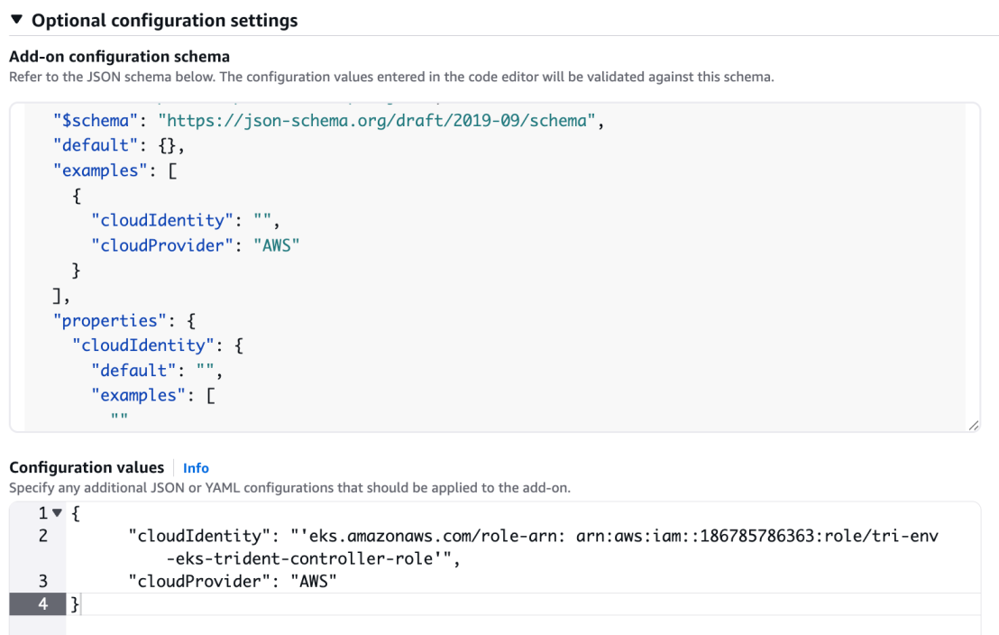

= 在EKS集群上配置Trident EKS加载项
:hardbreaks:
:allow-uri-read: 
:icons: font
:imagesdir: ../media/

[role="lead"]
NetApp Trident简化了Kubelnetes中适用于NetApp ONTAP的Amazon FSx存储管理、使开发人员和管理员能够专注于应用程序部署。NetApp Trident EKS加载项包括最新的安全修补程序和错误修复、并已通过AWS验证、可与Amazon EKS配合使用。通过EKS加载项、您可以始终确保Amazon EKS集群安全稳定、并减少安装、配置和更新加载项所需的工作量。

== 前提条件

在配置适用于AWS EKS的Trident加载项之前、请确保满足以下条件：

* 具有使用加载项的权限的Amazon EKS集群帐户。请参阅 link:https://docs.aws.amazon.com/eks/latest/userguide/eks-add-ons.html["Amazon EKS附加项"^]。
* AWS对AWS Marketplace的权限：
`"aws-marketplace:ViewSubscriptions",
"aws-marketplace:Subscribe",
"aws-marketplace:Unsubscribe`
* AMI类型：Amazon Linux 2 (AL2_x86_64)或Amazon Linux 2 ARM (AL2_ARM_64)
* 节点类型：AMD或ARM
* 现有Amazon FSx for NetApp ONTAP文件系统

== 步骤

. 请务必创建IAM角色和AWS密钥、以使EKS Pod能够访问AWS资源。有关说明，请参阅link:../trident-use/trident-fsx-iam-role.html["创建IAM角色和AWS机密"^]。
. 在EKS Kubernetes集群上、导航到*加载项*选项卡。
+
image::../media/aws-eks-01.png[AWS EKS 01]

. 转到*AWS Marketplace附加项*并选择_storage_类别。
+
image::../media/aws-eks-02.png[AWS EKS 02]

. 找到*Next* NetApp Trident并选中Trident插件的复选框，然后单击*Next*。
. 选择所需的附加软件版本。
+
image::../media/aws-eks-03.png[AWS EKS 03]

. 选择要从节点继承的IAM角色选项。
+
image::../media/aws-eks-04.png[AWS EKS 04]

. 遵循*附加配置模式*，并将*配置值*部分中的配置值参数设置为您在上一步(步骤1)中创建的ro-arn。值应采用以下格式：
+
[source, JSON]
----
{

  "cloudIdentity": "'eks.amazonaws.com/role-arn: <role ARN>'"

}
----
+

NOTE: 如果您为冲突解决方法选择覆盖、则可以使用Amazon EKS附加设置覆盖现有附加项的一个或多个设置。如果未启用此选项、并且与现有设置存在冲突、则操作将失败。您可以使用生成的错误消息来解决冲突。在选择此选项之前、请确保Amazon EKS附加组件未管理您需要自行管理的设置。

+

. 选择 * 创建 * 。
. 验证此加载项的状态是否为_Active_.
+
image::../media/aws-eks-05.png[AWS EKS 05]

. 运行以下命令以验证Trident是否已正确安装在集群上：
+
[listing]
----
kubectl get pods -n trident
----
. 继续设置并配置存储后端。有关信息，请参见 link:../trident-use/trident-fsx-storage-backend.html["配置存储后端"^]。

== 使用命令行界面安装/卸载Trident EKS加载项

.使用命令行界面安装NetApp Trident EKS加载项：
以下命令示例将安装Trident EKS加载项：
`eksctl create addon --cluster clusterName --name netapp_trident-operator --version v25.02.1-eksbuild.1`(使用专用版本)

.使用命令行界面卸载NetApp Trident EKS加载项：
以下命令将卸载Trident EKS加载项：

[listing]
----
eksctl delete addon --cluster K8s-arm --name netapp_trident-operator
----